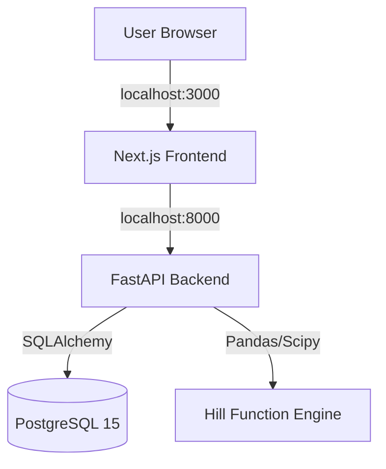

# Marginal Efficiency Radar 🎯

**Marketing FP&A Tool for Efficiency Analysis**

Identify diminishing returns in your ad spend. Calculate the "efficiency wall" for every marketing channel and stop wasting budget on saturated audiences.


---

## 🚀 Quick Start (Local First)

Get running in less than 2 minutes. No cloud account required.

### 1. Prerequisites
- Docker Desktop installed and running

### 2. Setup & Run
```bash
# Clone the repository
git clone https://github.com/davidhickeyesq/budgetradar.git
cd budgetradar

# Run initial setup (creates .env)
./setup.sh

# Start the application
make dev
```

### 3. Open Dashboard
- **Frontend:** [http://localhost:3000](http://localhost:3000)
- **API Docs:** [http://localhost:8000/docs](http://localhost:8000/docs)

The database is **auto-seeded** with demo data on first run. You should see Google Ads with traffic light indicators immediately.

---

## 📊 How It Works

1. **Ingest Data:** Upload daily spend/conversions CSVs or use the auto-generated seed data.
2. **Fit Hill Function:** The backend fits a Hill Function curve ($S$-curve) to your historical data:
   $$Conversions = \text{MaxYield} \times \frac{Spend^\beta}{\kappa^\beta + Spend^\beta}$$
3. **Calculate Marginal CPA:** It computes the cost to acquire the *next* conversion at your current spend level.
4. **Traffic Light Logic:**
   - 🟢 **Green:** Marginal CPA < Target (Scale spend)
   - 🟡 **Yellow:** Marginal CPA ≈ Target (Optimal efficiency)
   - 🔴 **Red:** Marginal CPA > Target (Diminishing returns - Pull back)
   - ⚪ **Grey:** Insufficient data (< 21 days)

## 👤 Default Account Context

The frontend now resolves account context from:

- `GET /api/accounts/default` → `{ "account_id": "<uuid>", "name": "<string>" }`

In local-first mode, import/sync requests with a valid but unknown `account_id`
auto-create that account before ingesting data.

---

## 📈 Scenario Planner (P005)

The dashboard now includes a Scenario Planner card that can:

- generate channel-level budget moves from traffic-light output
- lock channels before simulation
- persist and reload saved scenarios

Recommendation simulation uses fixed **10% spend steps** per channel to stay
consistent with marginal CPA stability rules.

Planner UX copy mirrors the same policy:
`Budget moves are simulated in fixed 10% steps to preserve marginal-curve numerical stability.`
This keeps operator messaging aligned with the AGENTS.md math canon.

### Confidence Policy (P009)

Analysis and scenario payloads expose `data_quality_state`:

- `ok`: model fit passed confidence threshold
- `low_confidence`: model fit available but below confidence threshold
- `insufficient_history`: fewer than 21 non-zero spend days

Traffic light remains an efficiency signal only. Scenario behavior for
`low_confidence` channels is policy-driven:

- `LOW_CONFIDENCE_SCENARIO_POLICY=hold` (default): hold spend constant
- `LOW_CONFIDENCE_SCENARIO_POLICY=block`: hold spend and mark action blocked

### Scenario APIs

- `POST /api/scenarios/recommend`
  - Request:
    ```json
    {
      "account_id": "a8465a7b-bf39-4352-9658-4f1b8d05b381",
      "target_cpa": 50,
      "budget_delta_percent": 0,
      "locked_channels": ["Google Ads"]
    }
    ```
  - Response:
    ```json
    {
      "scenario_name": "Auto Scenario (+0.0% budget) - 2026-02-22 18:30 UTC",
      "recommendations": [
        {
          "channel_name": "Google Ads",
          "action": "maintain",
          "data_quality_state": "low_confidence",
          "is_action_blocked": true,
          "blocked_reason": "Action blocked by low-confidence policy: Model fit R² 0.420 is below policy threshold 0.650."
        }
      ],
      "projected_summary": {}
    }
    ```
- `POST /api/scenarios`
  - Persists a scenario payload in the `scenarios` table.
- `GET /api/scenarios/{account_id}`
  - Returns saved scenarios for the account (most recent first).

---

## 📦 Common Commands

We use `make` to simplify common development tasks:

| Command | Description |
|---------|-------------|
| `make dev` | Start all services (Frontend, Backend, Postgres) |
| `make seed` | Re-populate the database with fresh demo data |
| `make clean` | Stop containers and remove all data volumes (Fresh start) |
| `make logs` | Stream logs from all services |
| `make health` | Check health status of all 3 services |
| `make test` | Run backend tests (local venv/system pytest, Docker fallback) |

---

## 📁 CSV Import Format

You can upload your own marketing data at [http://localhost:3000/import](http://localhost:3000/import).
Download the [template CSV here](http://localhost:8000/api/import/template).

**Required Columns:**
- `date`: YYYY-MM-DD
- `channel_name`: String (e.g. "Google Ads")
- `spend`: Numeric (no currency symbols)
- `conversions`: Numeric (decimals allowed)

**Optional:**
- `impressions`: Integer

---

## 🔄 Google Ads Sync (MVP Interface)

`POST /api/import/google-ads/sync`

Request payload:

```json
{
  "account_id": "00000000-0000-0000-0000-000000000000",
  "customer_id": "123-456-7890",
  "date_from": "2025-01-01",
  "date_to": "2025-01-15"
}
```

Response payload:

```json
{
  "success": true,
  "provider_mode": "mock",
  "rows_imported": 30,
  "channels": ["Google Display", "Google Search"],
  "date_range": {
    "start": "2025-01-01",
    "end": "2025-01-15"
  }
}
```

`provider_mode` indicates which backend provider handled the sync:

- `mock` (default): deterministic local provider for zero-credential local-first development.
- `real`: live Google Ads API provider (requires credentials).

### Google Ads Provider Mode

Set `GOOGLE_ADS_PROVIDER=mock|real`.

- `mock` keeps deterministic local sync behavior and requires no Ads credentials.
- `real` enables live Google Ads fetching and requires:
  - `GOOGLE_ADS_DEVELOPER_TOKEN`
  - `GOOGLE_ADS_CLIENT_ID`
  - `GOOGLE_ADS_CLIENT_SECRET`
  - `GOOGLE_ADS_REFRESH_TOKEN`
  - optional `GOOGLE_ADS_LOGIN_CUSTOMER_ID`

When `GOOGLE_ADS_PROVIDER=real` and credentials are missing, sync returns `400` with actionable detail.

---

## 🔐 Optional API Key Protection

Set `REQUIRE_API_KEY=true` and `APP_API_KEY=<your-key>` to require `X-API-Key` on protected API routes (`/api/*`, excluding `/api/health`).

---

## 🏗️ Architecture

The Local-First version runs entirely on your machine via Docker Compose:



See [ARCHITECTURE.md](ARCHITECTURE.md) for deep dive.

---

## 🔧 Configuration (.env)

| Variable | Default | Description |
|----------|---------|-------------|
| `DATABASE_URL` | postgres://... | Internal Docker network URL |
| `MIN_DATA_DAYS` | 21 | Minimum days required for model fitting |
| `MARGINAL_INCREMENT` | 0.10 | Spend increment (10%) for marginal calc |
| `MIN_CONFIDENCE_R_SQUARED` | `0.65` | R² threshold below which a fit is `low_confidence` |
| `LOW_CONFIDENCE_SCENARIO_POLICY` | `hold` | Planner policy for low-confidence channels (`hold` or `block`) |
| `REQUIRE_API_KEY` | `false` | Enable API key guardrail for protected API routes |
| `APP_API_KEY` | _(empty)_ | Expected `X-API-Key` value when guardrail is enabled |
| `NEXT_PUBLIC_APP_API_KEY` | _(empty)_ | Frontend API key header for protected backend mode |
| `GOOGLE_ADS_MAX_SYNC_DAYS` | `93` | Max date span accepted by Google Ads sync endpoint |
| `GOOGLE_ADS_PROVIDER` | `mock` | Google Ads sync provider mode (`mock` or `real`) |
| `GOOGLE_ADS_DEVELOPER_TOKEN` | _(empty)_ | Required in `real` provider mode |
| `GOOGLE_ADS_CLIENT_ID` | _(empty)_ | Required in `real` provider mode |
| `GOOGLE_ADS_CLIENT_SECRET` | _(empty)_ | Required in `real` provider mode |
| `GOOGLE_ADS_REFRESH_TOKEN` | _(empty)_ | Required in `real` provider mode |
| `GOOGLE_ADS_LOGIN_CUSTOMER_ID` | _(empty)_ | Optional manager account for `real` provider mode |

---

## 🤝 Contributing

Contributions are welcome! Please feel free to submit a Pull Request.

---

## 📄 License

MIT License. See [LICENSE](LICENSE) for details.
