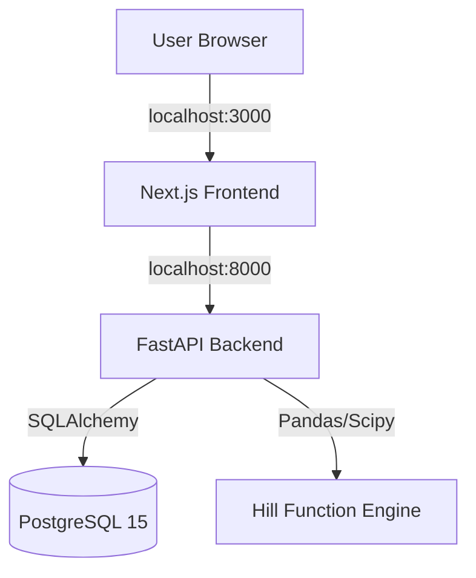

# Marginal Efficiency Radar 🎯

**Marketing FP&A Tool for Efficiency Analysis**

Identify diminishing returns in your ad spend. Calculate the "efficiency wall" for every marketing channel and stop wasting budget on saturated audiences.


---

## 🚀 Quick Start (Local First)

Get running in less than 2 minutes. No cloud account required.

### 1. Prerequisites
- Docker Desktop installed and running

### 2. Setup & Run
```bash
# Clone the repository
git clone https://github.com/davidhickeyesq/budgetradar.git
cd budgetradar

# Run initial setup (creates .env)
./setup.sh

# Start the application
make dev
```

### 3. Open Dashboard
- **Frontend:** [http://localhost:3000](http://localhost:3000)
- **API Docs:** [http://localhost:8000/docs](http://localhost:8000/docs)

The database is **auto-seeded** with demo data on first run. You should see Google Ads with traffic light indicators immediately.

---

## 📊 How It Works

1. **Ingest Data:** Upload daily spend/conversions CSVs or use the auto-generated seed data.
2. **Fit Hill Function:** The backend fits a Hill Function curve ($S$-curve) to your historical data:
   $$Conversions = \text{MaxYield} \times \frac{Spend^\beta}{\kappa^\beta + Spend^\beta}$$
3. **Calculate Marginal CPA:** It computes the cost to acquire the *next* conversion at your current spend level.
4. **Traffic Light Logic:**
   - 🟢 **Green:** Marginal CPA < Target (Scale spend)
   - 🟡 **Yellow:** Marginal CPA ≈ Target (Optimal efficiency)
   - 🔴 **Red:** Marginal CPA > Target (Diminishing returns - Pull back)
   - ⚪ **Grey:** Insufficient data (< 21 days)

---

## 📦 Common Commands

We use `make` to simplify common development tasks:

| Command | Description |
|---------|-------------|
| `make dev` | Start all services (Frontend, Backend, Postgres) |
| `make seed` | Re-populate the database with fresh demo data |
| `make clean` | Stop containers and remove all data volumes (Fresh start) |
| `make logs` | Stream logs from all services |
| `make health` | Check health status of all 3 services |
| `make test` | Run backend unit tests |

---

## 📁 CSV Import Format

You can upload your own marketing data at [http://localhost:3000/import](http://localhost:3000/import).
Download the [template CSV here](http://localhost:8000/api/import/template).

**Required Columns:**
- `date`: YYYY-MM-DD
- `channel_name`: String (e.g. "Google Ads")
- `spend`: Numeric (no currency symbols)
- `conversions`: Numeric (decimals allowed)

**Optional:**
- `impressions`: Integer

---

## 🏗️ Architecture

The Local-First version runs entirely on your machine via Docker Compose:



See [ARCHITECTURE.md](ARCHITECTURE.md) for deep dive.

---

## 🔧 Configuration (.env)

| Variable | Default | Description |
|----------|---------|-------------|
| `DATABASE_URL` | postgres://... | Internal Docker network URL |

| `MIN_DATA_DAYS` | 21 | Minimum days required for model fitting |
| `MARGINAL_INCREMENT` | 0.10 | Spend increment (10%) for marginal calc |

---

## 🤝 Contributing

Contributions are welcome! Please feel free to submit a Pull Request.

---

## 📄 License

MIT License. See [LICENSE](LICENSE) for details.
